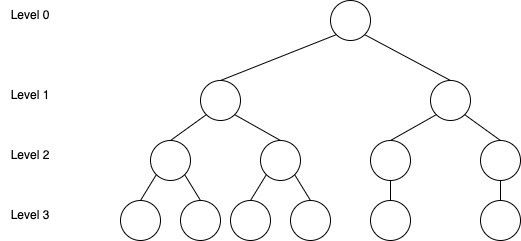

# WOO X merkle tree validation sample code

The sample code demonstrates how to validate the Merkle tree. The sample code is written in Java. It consists of only 1 Java file.

`MerkleCheck.java`

The entry point is the `main()` function in `MerkleCheck.java`. There are only two variables you need to provide and substitute:
1. Path of the Merkle tree binary file. (download from WOO X website)
2. User hash for your account for the specified audit. (obtained from WOO X after logging in)

Using the two variables will enable the code to run the Merkle tree validation process and retrieve the balance of your account for the audit. You are welcome to review the code yourself to verify the validation approach.

# Merkle Tree Binary Format
## Tree Structure

The leaf nodes are users' balances split into N parts (determined at random for each audit), and the Merkle Tree is a binary tree. Each leaf node, therefore, represents a portion of each user's balance at the time of the audit snapshot. The root node represents all users' balances at the time of the audit snapshot.

Any accounts with no assets or that did not pass KYC will not be represented on the Merkle tree. Also, any negative assets are not reflected on the tree to ensure no misrepresented negative balances can be added to the tree to under-report the overall sum of the users' balances. Each sub-account is represented separately from the main account in the tree.

In order for the leaf nodes to be at the same level, some leaf parents will only have a single leaf child. We also ensure every Level 2 node has at least one child. So we will assign at least one leaf node to every Level 2 node, and assign the remaining leaf nodes from left to right.




## Merkle Tree Format

The Merkle tree is serialized in ProtoBuffer format. The Proto files are as follows:

    message MerkleTree {
        repeated string tokens = 1; // token and its index
        repeated MerkleNode nodes = 2;
    }

The tree binary file start with a list of token names (eg BTC, ETH), and the index for the token is used to represent the token itself in the corresponding representation [1].

The second file is a list of MerkleNode messages, it represents a single node in the merkle tree. The format is as below:

    message MerkleNode {
        optional bytes hash = 1;  
        optional bytes left= 2; // hash of left merkle node  
        optional bytes right = 3;  // hash of right merkle node
        optional bytes parent = 4;  
        MerkleBalanceVector balance = 5;
    }

The attributes `left`/`right` are the hashes of the left/right child of the current node. When the tree is loaded, we can construct the binary tree structure using the left, right, and parent attributes.

The `hash` attribute represents the hash of the node. The hash of the intermediary MerkleNode (non-leaf) is generated by:

```
    sha256(concat(left_child.hash, right_child.hash))
```

And the hash of a leaf `MerkleNode` is generated by:

```
    sha256(user_hash, leaf_balance_vector, leaf_position_index)
```

For the `leaf_balance_vector` and `leaf_position_index` parts, we use the `MerkleBalanceVector` Proto message as the byte array input. The format is shown below:

    message MerkleBalanceVector {
        repeated int32 index = 1;   
        repeated string balances = 2;  
        optional int32 leafIndex = 3;
    }

The `index` attribute is a list of tokens. We can find the mapping for the token-string-representation in [1]. The `balances` attribute represents the quantity of each token.

The calculation process of leaf node hash is as follows:

    MerkleBalanceVector merkleBalanceVector = build();             // construct the MerkleBalanceVector message.
    byte[] bytes = merkleBalanceVector.serialized().toByteArray(); // serialized bytes of the message.
    byte[] userHash = doGetUserHash()                              // user hash.
    byte[] hashOfLeaf = sha256(concat(userHash, bytes));           // hash of leaf node.

And finally, the `userHash` uses ProtoBuffer message like this:

    message UserHash {
        int64 uid = 1;       // UID of the account
        string nonce = 2;    // application-id of the account
        int64 timestamp = 3; // timestamp of the audit in Unix epoch milliseconds
    }

    UserHash userHash = build(); // build user hash message.
    byte[] bytes = userHash.serialized().toByteArray();
    byte[] userHash = sha256(bytes); // get the user hash byte array.

# Validation Algorithm

The validation algorithm attempts to find all leaf nodes that matches the `UserHash` by calculating the `hash` of the leaf nodes based on the `UserHash` input and comparing against the `hash` of the leaf node. Matches are ensured to be unique by adding the `leafIndex` which is the leaf's unique id in the tree. 

After finding all matched leaf nodes, the algorithm will sum up the balances of the leaf nodes, which should then equal the total balances of the account at the time of the snapshot (also provided in the WOO X Audit page after logging in for each account/subaccount).
